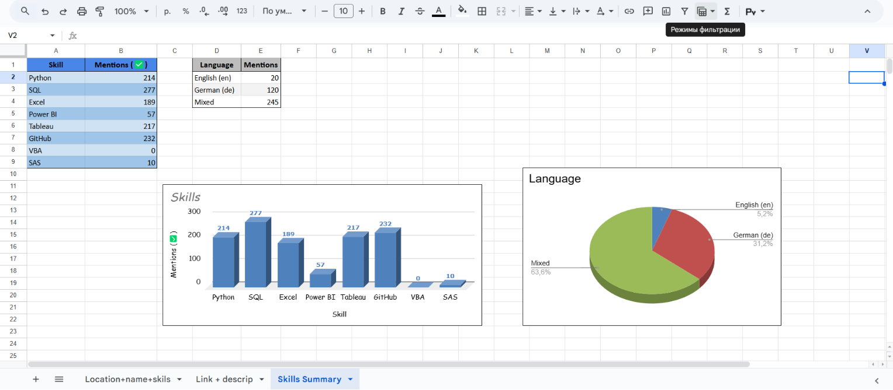

# 📊 Junior Data Analyst Jobs in Germany (2025)

This project analyzes job listings for junior data analyst positions in Germany, focusing on required skills, language, remote options, and tool expectations.

## 📌 Project Goals
- Understand what employers expect from junior data analysts in Germany
- Evaluate my current skills against market demand
- Build a portfolio-ready project with real data
- Visualize insights and share it on GitHub

---

## 📂 Dataset

The dataset was collected from LinkedIn job postings and includes:
- Title, Company, Location, Link
- Job Description (scraped from each listing)
- Remote tag, Language detection
- Boolean flags for skills: Python, SQL, Excel, Power BI, Tableau, Git, VBA, SAS

📁 [View dataset (CSV)](data/linkedin_jobs_enriched.csv)

---

## ⚙️ Tools & Technologies
- `Python` (BeautifulSoup, Requests, Pandas)
- `Google Sheets` (for visualization and summary)
- `Power BI` (optionally for dashboards)
- `GitHub` (for versioning and publishing)

---

## 📊 Visualizations

### ✅ Most In-Demand Skills

### 🌍 Language of Job Descriptions

### 🔗 Full Interactive Dashboard (Google Sheets)

[View Dashboard](https://docs.google.com/spreadsheets/d/1vQnHjGAF1fDDcTjJorZub81E1T_T4vduc-Po05_frJs/edit?usp=sharing)

---

## 📜 Code Structure

- `notebooks/linkedin_scraper.ipynb` → scraping job listings + enrichment
- `data/` → CSV with structured and enriched data
- `visuals/` → exported charts and summary visuals

---

## 🔐 Disclaimer

This project is for **educational and portfolio purposes only**.  
The data was collected from publicly available job listings on LinkedIn without authentication.  
No personal user data was accessed or stored.  
If LinkedIn or any other party requests removal, this repository will be taken down.

---

## 🙋‍♂️ About Me

I'm a junior data analyst enthusiastically diving into real data to explore the job market and grow my skills step-by-step.  
This is my first public project — and there's more to come 🚀

